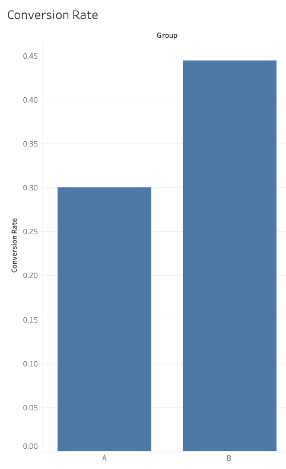
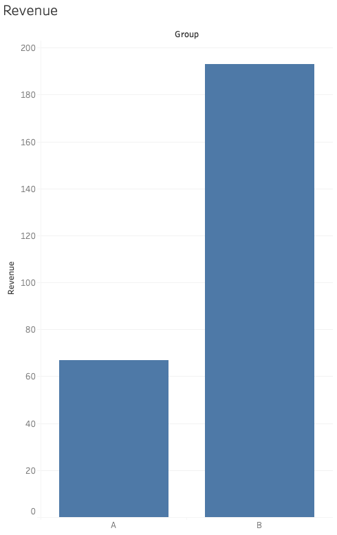

# 📊 Marketing A/B Testing & Campaign Analytics (SQL & Tableau Public)

This project analyzes A/B testing experiments to evaluate marketing campaign performance and optimize conversion rates. SQL was used to compute key metrics, and Tableau Public was used to build interactive dashboards for monitoring ROI and engagement.

---

## 📈 Project Overview

The objective of this project is to compare two campaign variants (A vs B) and determine which performs better using key performance indicators such as conversion rate, click-through rate (CTR), and revenue.

This project combines technical analysis with business decision-making to simulate real-world marketing analytics workflows.

---

## 🎯 Key Objectives

- **A/B Testing Analysis**: Compare campaign variants and measure performance differences  
- **SQL Analysis**: Calculate key marketing metrics using SQL  
- **Data Visualization**: Build dashboards in Tableau Public  
- **Business Insights**: Translate results into actionable recommendations  

---

## 📂 Dataset

The dataset simulates marketing campaign performance with the following fields:

- `user_id`  
- `group_name` (A/B test group)  
- `impressions`  
- `clicks`  
- `conversions`  
- `revenue`  

---

## 🧠 Methodology

### SQL Analysis (Jupyter Notebook)
- Created a SQLite database within Jupyter  
- Executed SQL queries using `ipython-sql`  
- Aggregated campaign performance by group  
- Calculated:
  - **Conversion Rate** = conversions / clicks  
  - **CTR (Click Through Rate)** = clicks / impressions  
  - **Total Revenue**

### A/B Testing Evaluation
- Compared Variant A vs Variant B across all KPIs  
- Identified the highest-performing campaign  

### Data Visualization (Tableau Public)
- Built dashboards to visualize:
  - Conversion Rate comparison  
  - Revenue performance  
  - Campaign effectiveness  

---

## 📊 Key Results

- Variant B achieved a higher conversion rate than Variant A  
- Variant B generated higher total revenue  
- Higher engagement levels (clicks and conversions) contributed to improved performance  

---

## 📸 Visualizations

### Conversion Rate Comparison


### Revenue Dashboard


---

## 💡 Business Insights

- Campaign performance is strongly influenced by user engagement  
- Variant B consistently outperforms Variant A across key metrics  
- Improved conversion rates directly translate into increased revenue  

---

## 🚀 Business Recommendations

- Allocate more budget to Variant B to maximize ROI  
- Analyze differences between variants to replicate successful elements  
- Continue running A/B tests to further optimize campaign performance  

---

## 🛠 Tools Used

- SQL (SQLite via Jupyter Notebook)  
- Tableau Public  
- Data Analysis & Visualization  

---

## ⚠️ Notes

- Tableau Public dashboards are not included as `.twbx` files due to platform limitations  
- Visual outputs are provided as screenshots in the `screenshots/` folder  
- SQL queries were executed within Jupyter Notebook using SQLite  

---

## 📂 Repository Structure

````
ab-testing-marketing/
├── ab_testing_analysis.ipynb
├── campaign_data.csv
├── screenshots/
└── README.md
````

---

## 🎯 Conclusion

This project demonstrates how A/B testing combined with SQL analysis can be used to evaluate marketing performance, optimize campaigns, and support data-driven decision-making in real business scenarios.
