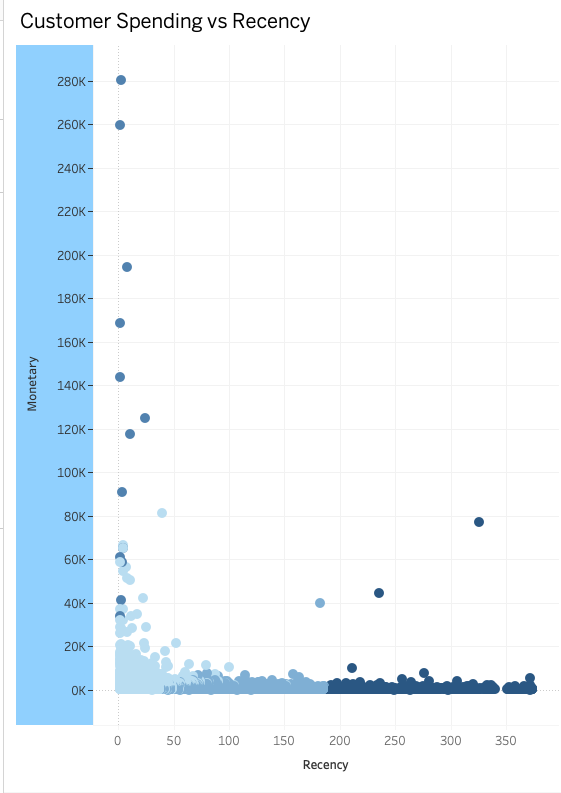
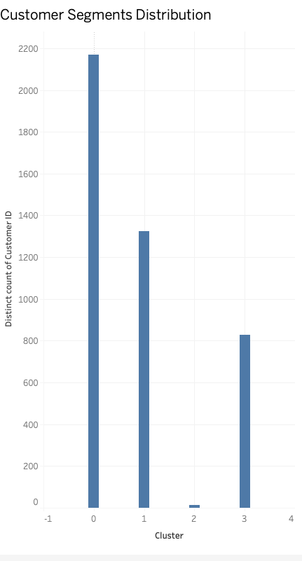

# 🧩 Customer Segmentation Analysis

This project demonstrates customer segmentation techniques using Python and Tableau Public applied to a retail dataset.

The objective is to identify high-value customer segments using clustering and provide insights to support targeted marketing strategies.

---

## 📊 Dataset

Retail transactional dataset including:

- `InvoiceNo`
- `StockCode`
- `Description`
- `Quantity`
- `InvoiceDate`
- `UnitPrice`
- `CustomerID`
- `Country`

### RFM Metrics

- **Recency** – Days since last purchase  
- **Frequency** – Number of transactions  
- **Monetary** – Total customer spending  

---

## 🧠 Methodology

### Data Preparation
- Data cleaning and handling missing values  
- Feature engineering to compute RFM metrics  

### Exploratory Data Analysis (EDA)
- Detection of outliers  
- Analysis of customer behavior patterns  

### Clustering
- Applied **K-Means clustering**  
- Segmented customers into 4 distinct groups  

### Visualization
- Built dashboards in **Tableau Public**  
- Visualized clusters and key customer metrics  

---

## ⭐ High-Value Segment

Customers with:

- Low Recency  
- High Frequency  
- High Monetary value  

👉 Represent the most valuable customers for the business

---

## 💡 Business Insights

- A small group of customers generates a large portion of revenue  
- Customer behavior varies significantly across segments  
- High-value customers show strong purchase frequency and engagement  

---

## 🚀 Business Recommendations

- Implement loyalty programs for high-value customers  
- Use personalized offers to increase retention  
- Design targeted campaigns based on customer segments  

---

## 🛠 Tools Used

- Python (Pandas, Scikit-learn)  
- K-Means Clustering  
- Tableau Public  
- Data Visualization  

---

## 📸 Visualizations

### Customer Segmentation (Clusters)


### Distribution of Customers by Cluster


---

## 📂 Repository Structure

````
customer-segmentation/
├── customer_segmentation.ipynb
├── rfm_segments.csv
├── screenshots/
└── README.md
````

---

## 🎯 Conclusion

This project demonstrates how clustering techniques can be used to identify valuable customer segments and support data-driven marketing strategies.

---

## ⚠️ Notes

- The dataset was used as a proxy to demonstrate segmentation techniques  
- Methodology can be applied to SMEs and real-world business scenarios  
- Original dataset excluded due to file size limitations  
