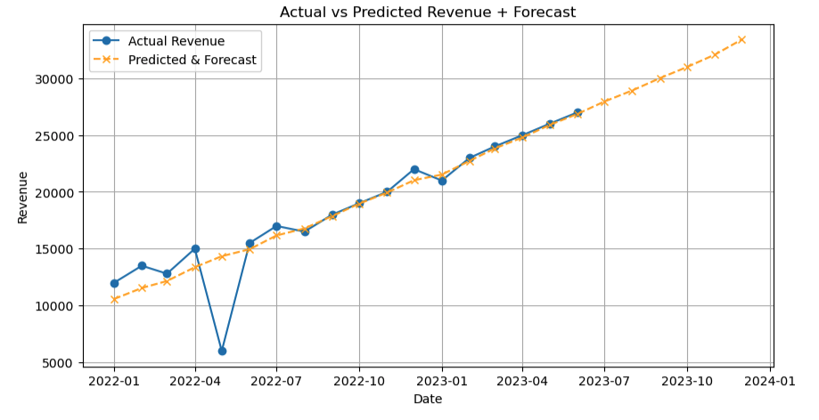
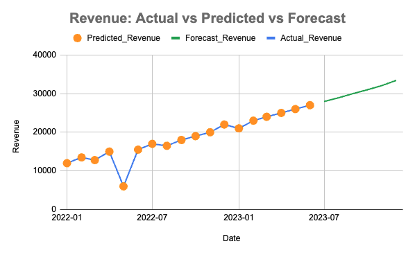
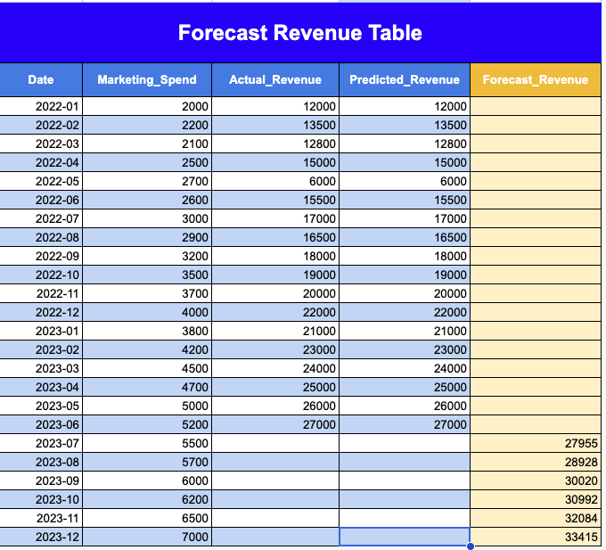

# 📊 Sales & Revenue Forecasting using Regression (Python + Excel)

This project builds a regression-based forecasting model to predict revenue trends and support campaign planning and KPI tracking. The model was developed in Python and replicated in Excel to simulate real business workflows.

---

## 📈 Project Overview

The goal of this project is to combine technical modeling with business thinking by forecasting revenue using a regression model. It demonstrates how predictions can inform real business decisions.

---

## 🎯 Key Objectives

- **Forecasting**: Predict future revenue based on historical data  
- **Regression Modeling**: Use Linear Regression with Time and Marketing Spend  
- **Business Insights**: Provide actionable recommendations  

---

## 📂 Dataset

- Columns: `Date`, `Revenue`, `Marketing_Spend`  
- Period: Jan 2022 – Jun 2023  
- Source: Simulated dataset  

---

## 🧠 Methodology

### Data Preparation
- Convert Date to datetime format  
- Sort data by date  
- Create a Time variable  

### Modeling
- Linear Regression:  
  **Revenue = f(Time + Marketing Spend)**  
- Train model on historical data  
- Predict next 6 months  

### Visualization
- Actual vs Predicted Revenue  
- Forecast trend  

---

## 📊 Forecast Results

| Month   | Predicted Revenue |
|--------|------------------|
| 2023-07 | 27,955 |
| 2023-08 | 28,928 |
| 2023-09 | 30,020 |
| 2023-10 | 30,992 |
| 2023-11 | 32,084 |
| 2023-12 | 33,415 |

---

## 📸 Visualizations

### Python Forecast


### Excel Forecast Chart


### Excel Forecast Table


---

## 📈 Executive Insights & Recommendations

### Revenue Forecast Overview
- Revenue is expected to grow ~20% in the next 6 months  
- Strong positive relationship between marketing spend and revenue  
- Overall upward trend with minor fluctuations  

### Key Insights
- Consistent revenue growth over time  
- Marketing investment drives higher sales  
- Some anomalies suggest external influencing factors  

### Business Recommendations
- Optimize marketing budget allocation  
- Monitor forecast vs actual performance  
- Investigate anomalies in revenue  
- Use forecasts for KPI planning  

---

## 🛠 Skills Demonstrated

- Python (Pandas, Scikit-learn)  
- Linear Regression Modeling  
- Excel Forecasting  
- Data Visualization  
- Business Analysis  

---

## 📂 Repository Structure
````
sales-forecasting/
├── sales_forecasting.ipynb
├── dataset.csv
├── excel_model.xlsx
├── screenshots/
└── README.md
````
## 🎯 Conclusion

This project demonstrates how regression models can be used to generate revenue forecasts and support data-driven business decisions.
